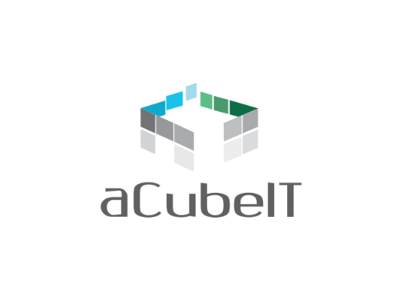

# Machine Learning for Life Sciences

Deep Learning for Life Sciences course by aCubeIT.

Repository for all lecture notes, labs, and projects resources.

#### Machine Learning topics: 

- Convolutional Neural Networks
- Recurrent Neural Networks (tbc)
- Generative Adversarial Networks

And how each of these types of artificial neural networks relate to life sciences and drug discovery.

By Eklavya Sarkar.

#### Programming topics:

- Python 3
- Variables Types (Strings, Booleans)
- Structures
- Functions
- Data Structures (Lists, Tuples, Dictionaries)
- Broadcasting
- Libraries (Numpy)

by Vidya Kurada.
